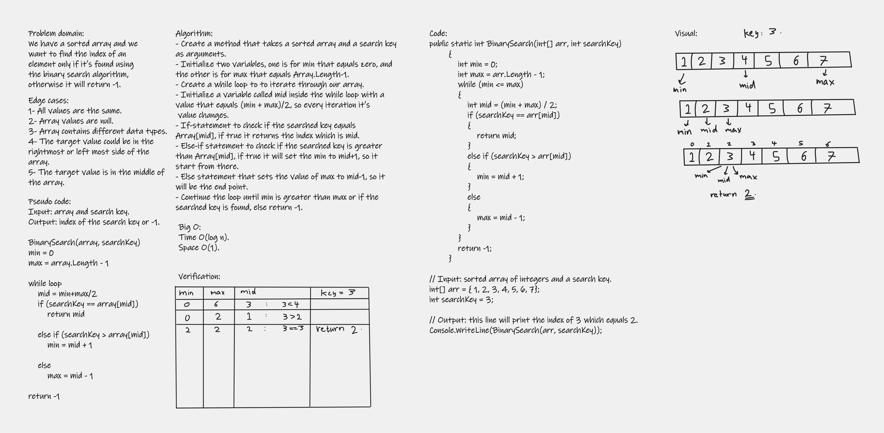

# Binary Search of Sorted Array
In this challenge, we were asked without utilizing any of the built-in methods to create a method that takes a sorted array and a search key as arguments, then apply the binary search algorithm inside the method to return the index of our searched number if found, otherwise return -1.

## Whiteboard Process

## Approach & Efficiency
I used the famous binary search algorithm on my sorted array; because the time complexity is Big O(logn) and for space complexity is Big O(1), so I can get the best space/time complexity for my problem.
