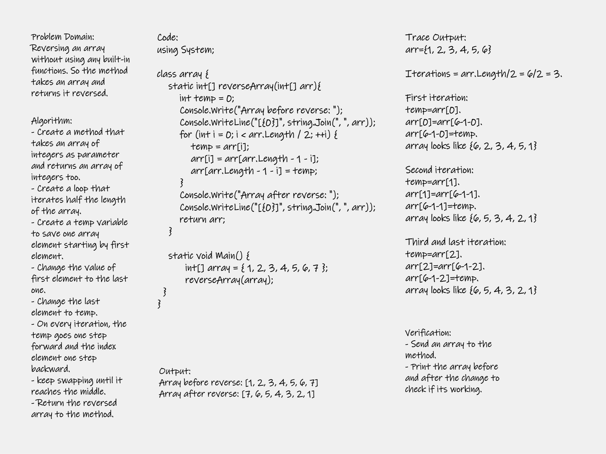

# Reverse an Array
In this challenge, we are asked to create a method that reverses an array and return it back without using any built-in methods. So the method takes an array as an argument and retruns a new one but reversed.

---
## Whiteboard Process

---
## Approach & Efficiency
I used a temp variable to save one value, so every iteration i spwap two values. This is very efficient; because there is no need to create a new array and it only loop half of the array. So the complexity is O(n).