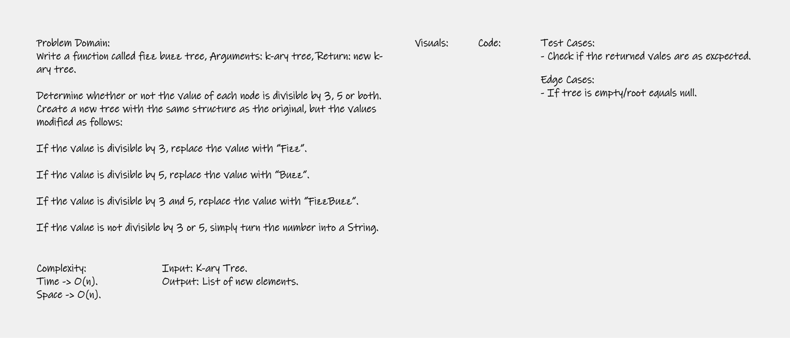

# Challenge 18 - FizzBuzz
Write a function called fizz buzz tree, Arguments: k-ary tree, Return: new k-ary tree. 

Determine whether or not the value of each node is divisible by 3, 5 or both. Create a new tree with the same structure as the original, but the values modified as follows:

If the value is divisible by 3, replace the value with “Fizz”.

If the value is divisible by 5, replace the value with “Buzz”.

If the value is divisible by 3 and 5, replace the value with “FizzBuzz”.

If the value is not divisible by 3 or 5, simply turn the number into a String.

## Whiteboard Process



## Approach & Efficiency
Big O(n) for both space & time. 

## Solution
Code:
```
using System;
using System.Collections.Generic;
using System.Linq;
using System.Text;
using System.Threading.Tasks;

namespace DataStructure.DSA.FizzBuzz
{
    public class FizzBuzzTree
    {
        public string Value { get; set; }
        public List<FizzBuzzTree> Children { get; set; }
        
        public FizzBuzzTree()
        {

        }

        public FizzBuzzTree(string data)
        {
            Value = data;
            Children = new List<FizzBuzzTree>();
        }

        public FizzBuzzTree(string data, List<FizzBuzzTree> child)
        {
            Value = data;
            Children = child;
        }

        public List<string> FizzBuzz(FizzBuzzTree root)
        {
            List<string> list = new List<string>();
            if (root == null)
            {
                return null;
            }
            Queue<FizzBuzzTree> queue = new Queue<FizzBuzzTree>();
            queue.Enqueue(root);

            while (queue.Count > 0)
            {
                int len = queue.Count();
                for (int i = 0; i < len; i++)
                {
                    int value = Convert.ToInt32(queue.First().Value);
                    if (value % 15 == 0)
                    {
                        list.Add("FizzBuzz");
                    }
                    else if (value % 3 == 0)
                    {
                        list.Add("Fizz");
                    }
                    else if (value % 5 == 0)
                    {
                        list.Add("Buzz");
                    }
                    else
                    {
                        list.Add(queue.First().Value);
                    } 
                    FizzBuzzTree node = queue.Dequeue();
                    foreach (FizzBuzzTree item in node.Children)
                    {
                        queue.Enqueue(item);
                    }
                }
            }
            return list;
        }
        public List<string> Traverse(FizzBuzzTree root)
        {
            List<string> list = new List<string>();
            if (root == null)
            {
                return null;
            }
            Queue<FizzBuzzTree> queue = new Queue<FizzBuzzTree>();
            queue.Enqueue(root);

            while (queue.Count > 0)
            {
                int len = queue.Count();
                for (int i = 0; i < len; i++)
                {
                    FizzBuzzTree node = queue.Dequeue();
                    list.Add(node.Value);
                    foreach (FizzBuzzTree item in node.Children)
                    {
                        queue.Enqueue(item);
                    }
                }
            }
            return list;
        }
    }
}
```
