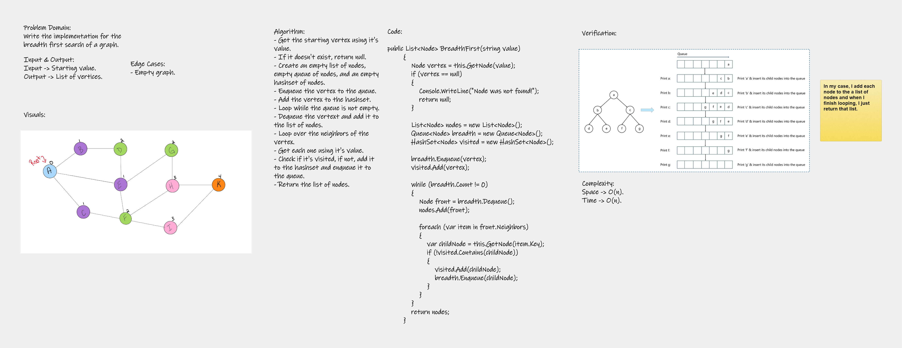

# Breadth-First Traversal of 
Write the implementation for the breadth first search of a graph.

## Whiteboard Process



## Approach & Efficiency
<!-- What approach did you take? Why? What is the Big O space/time for this approach? -->
Complexity:
Space -> O(n); because I used additional space to traverse the graph.
Time -> O(n); because I had to visit the entire graph which has n number of nodes.

## Solution

```
Code:

public List<Node> BreadthFirst(string value)
        {
            Node vertex = this.GetNode(value);
            if (vertex == null)
            {
                Console.WriteLine("Node was not found!");
                return null;
            }

            List<Node> nodes = new List<Node>();
            Queue<Node> breadth = new Queue<Node>();
            HashSet<Node> visited = new HashSet<Node>();

            breadth.Enqueue(vertex);
            visited.Add(vertex);

            while (breadth.Count != 0)
            {
                Node front = breadth.Dequeue();
                nodes.Add(front);

                foreach (var item in front.Neighbors)
                {
                    var childNode = this.GetNode(item.Key);
                    if (!visited.Contains(childNode))
                    {
                        visited.Add(childNode);
                        breadth.Enqueue(childNode);
                    }
                }
            }
            return nodes;
        }
```
