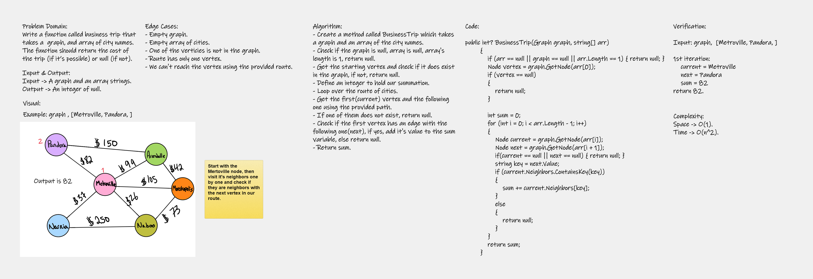

# Challenge Summary
Write a function called business trip that takes a  graph, and array of city names. The function should return the cost of the trip (if it’s possible) or null (if not).

## Whiteboard Process


## Approach & Efficiency
### Algorithm:
- Create a method called BusinessTrip which takes a graph and an array of the city names.
- Check if the graph is null, array is null, array's length is 1, return null.
- Get the starting vertex and check if it does exist in the graph, if not, return null.
- Define an integer to hold our summation.
- Loop over the route of cities.
- Get the first(current) vertex and the following one using the provided path.
- If one of them does not exist, return null.
- Check if the first vertex has an edge with the following one(next), if yes, add it's value to the sum variable, else return null.
- Return sum.

### Complexity:
+ Space -> O(1).
+ Time -> O(n^2).

## Solution

```
Code:

public int? BusinessTrip(Graph graph, string[] arr)
        {
            if (arr == null || graph == null || arr.Length == 1) { return null; }
            Node vertex = graph.GetNode(arr[0]);
            if (vertex == null)
            {
                return null;
            }

            int sum = 0;
            for (int i = 0; i < arr.Length - 1; i++)
            {
                Node current = graph.GetNode(arr[i]);
                Node next = graph.GetNode(arr[i + 1]);
                if(current == null || next == null) { return null; }
                string key = next.Value;
                if (current.Neighbors.ContainsKey(key))
                {
                    sum += current.Neighbors[key];
                }
                else
                {
                    return null;
                }
            }
            return sum;
        }
```
