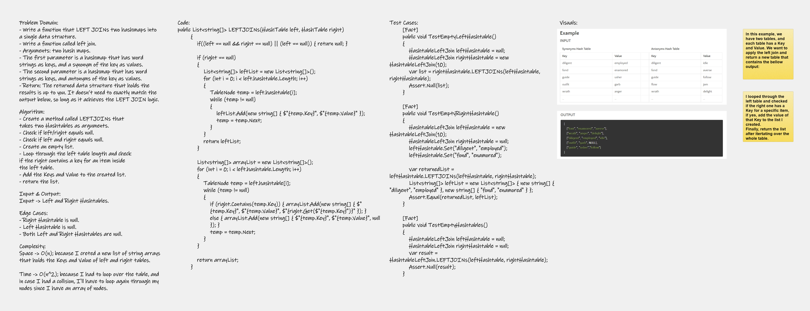

# Hashmap LEFT JOIN
<!-- Short summary or background information -->
The SQL LEFT JOIN returns all rows from the left table, even if there are no matches in the right table. This means that if the ON clause matches 0 (zero) records in the right table; the join will still return a row in the result, but with NULL in each column from the right table.

This means that a left join returns all the values from the left table, plus matched values from the right table or NULL in case of no matching join predicate.

### Syntax
The basic syntax of a LEFT JOIN is as follows.

```
SELECT table1.column1, table2.column2...
FROM table1
LEFT JOIN table2
ON table1.common_field = table2.common_field;
```


### Example
Consider the following two tables,

**Table 1** − CUSTOMERS Table is as follows.
```
+----+----------+-----+-----------+----------+
| ID | NAME     | AGE | ADDRESS   | SALARY   |
+----+----------+-----+-----------+----------+
|  1 | Ramesh   |  32 | Ahmedabad |  2000.00 |
|  2 | Khilan   |  25 | Delhi     |  1500.00 |
|  3 | kaushik  |  23 | Kota      |  2000.00 |
|  4 | Chaitali |  25 | Mumbai    |  6500.00 |
|  5 | Hardik   |  27 | Bhopal    |  8500.00 |
|  6 | Komal    |  22 | MP        |  4500.00 |
|  7 | Muffy    |  24 | Indore    | 10000.00 |
+----+----------+-----+-----------+----------+
```

**Table 2** − Orders Table is as follows.
```
+-----+---------------------+-------------+--------+
| OID | DATE                | CUSTOMER_ID | AMOUNT |
+-----+---------------------+-------------+--------+
| 102 | 2009-10-08 00:00:00 |           3 |   3000 |
| 100 | 2009-10-08 00:00:00 |           3 |   1500 |
| 101 | 2009-11-20 00:00:00 |           2 |   1560 |
| 103 | 2008-05-20 00:00:00 |           4 |   2060 |
+-----+---------------------+-------------+--------+
```

**Table 3** - after applying the LEFT JOIN those two tables:
```
+----+----------+--------+---------------------+
| ID | NAME | AMOUNT | DATE |
+----+----------+--------+---------------------+
| 1 | Ramesh | NULL | NULL |
| 2 | Khilan | 1560 | 2009-11-20 00:00:00 |
| 3 | kaushik | 3000 | 2009-10-08 00:00:00 |
| 3 | kaushik | 1500 | 2009-10-08 00:00:00 |
| 4 | Chaitali | 2060 | 2008-05-20 00:00:00 |
| 5 | Hardik | NULL | NULL |
| 6 | Komal | NULL | NULL |
| 7 | Muffy | NULL | NULL |
+----+----------+--------+---------------------+
```

---

## Challenge
<!-- Description of the challenge -->
- Write a function that LEFT JOINs two hashmaps into a single data structure.
- Write a function called left join.
- Arguments: two hash maps.
- The first parameter is a hashmap that has word strings as keys, and a synonym of the key as values.
- The second parameter is a hashmap that has word strings as keys, and antonyms of the key as values.
- Return: The returned data structure that holds the results is up to you. It doesn’t need to exactly match the output below, so long as it achieves the LEFT JOIN logic.

---

## Approach & Efficiency
### Complexity: 
+ Space -> O(n); because I creted a new list of string arrays that holds the Keys and Value of left and right tables.

+ Time -> O(n^2); because I had to loop over the table, and in case I had a collision, I'll have to loop again through my nodes since I have an array of nodes.

---

## Solution
### Whiteboard Image:



### Code in C#:
```
public static List<string[]> LEFTJOINs(HashTable left, HashTable right)
        {
            if((left == null && right == null) || (left == null)) { return null; }

            if (right == null)
            {
                List<string[]> leftList = new List<string[]>();
                for (int i = 0; i < left.hashtable.Length; i++)
                {
                    TableNode temp = left.hashtable[i];
                    while (temp != null)
                    {
                        leftList.Add(new string[] { $"{temp.Key}", $"{temp.Value}" });
                        temp = temp.Next;
                    }
                }
                return leftList;
            }

            List<string[]> arrayList = new List<string[]>();
            for (int i = 0; i < left.hashtable.Length; i++)
            {
                TableNode temp = left.hashtable[i];
                while (temp != null)
                {
                    if (right.Contains(temp.Key)) { arrayList.Add(new string[] { $"{temp.Key}", $"{temp.Value}", $"{right.Get($"{temp.Key}")}" }); }
                    else { arrayList.Add(new string[] { $"{temp.Key}", $"{temp.Value}", null }); }
                    temp = temp.Next;
                }
            }

            return arrayList;
        }
```