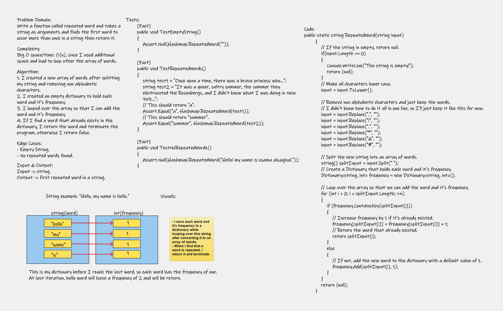

# Hashmap Repeated Word
Write a function called repeated word and takes a string as arguments and finds the first word to occur more than once in a string then return it.

---
## Whiteboard Process


---
## Approach & Efficiency
1. I created a new array of words after splitting my string and removing non alphabetic characters.
2. I created an empty dictionary to hold each word and it's frequency.
3. I looped over the array so that I can add the word and it's frequency.
4. If I find a word that already exists in the dictionary, I return the word and terminate the program, otherwise I return false.

Comlexity: Big O space/time of O(n), since I used additional space and had to loop other the array of words.

---
## Solution
<!-- Show how to run your code, and examples of it in action -->
```
public static string RepeatedWord(string input)
        {
            // If the string in empty, return null.
            if(input.Length == 0)
            {
                Console.WriteLine("The string is empty!");
                return (null);
            }
            // Make all characters lower case.
            input = input.ToLower();

            // Remove non alphabetic characters and just keep the words.
            // I didn't know how to do it all in one line, so I'll just keep it like this for now.
            input = input.Replace(",", "");
            input = input.Replace("!", "");
            input = input.Replace(".", "");
            input = input.Replace("*", "");
            input = input.Replace("&", "");
            input = input.Replace("#", "");

            // Split the new string into an array of words.
            string[] splitInput = input.Split(" ");
            // Create a Dictionary that holds each word and it's frequency.
            Dictionary<string, int> frequency = new Dictionary<string, int>();

            // Loop over the array so that we can add the word and it's frequency.
            for (int i = 0; i < splitInput.Length; ++i)
            {
                if (frequency.ContainsKey(splitInput[i]))
                {
                    // Increase frequency by 1 if it's already existed.
                    frequency[splitInput[i]] = frequency[splitInput[i]] + 1;
                    // Return the word that already existed.
                    return splitInput[i];
                }
                else
                {
                    // If not, add the new word to the dictionary with a default value of 1.
                    frequency.Add(splitInput[i], 1);
                }
            }
            return (null);
        }
```