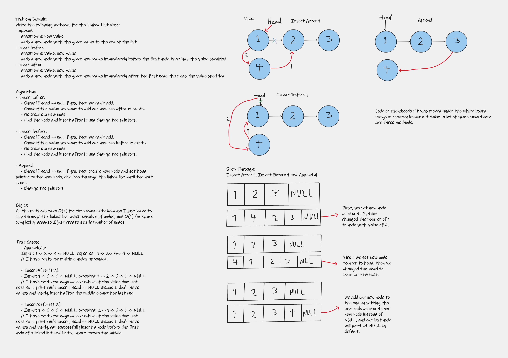

# Challenge Summary

Write the following methods for the Linked List class:
- append:
    arguments: new value
    adds a new node with the given value to the end of the list
- insert before
    arguments: value, new value
    adds a new node with the given new value immediately before the first node that has the value specified
- insert after
    arguments: value, new value
    adds a new node with the given new value immediately after the first node that has the value specified
---

## Whiteboard Process
<!-- Embedded whiteboard image -->


---

## Approach & Efficiency
I used while loop to loop through the linked list since it's the only way to do that and used if-statements to check some conditions. What is the Big O space/time for this approach? Big O(n) for space for all methods and O(1) for time for all methods.

---

## Solution
Here is the code for my Append, insert after and insert before methods. You can run them by creating a linked list then call these functions after you copy them to your linked list class or you can just copy my project and test it by yourself.
```
public void AppendLink(int data)
        {
            if (head == null)
            {
                Node newNode = new Node(data);
                newNode.next = head;
                head = newNode;
            }
            else
            {
                Node temp = head;
                while (temp.next != null)
                {
                    temp = temp.next;
                }
                Node newNode = new Node(data);
                temp.next = newNode;
            }
        }

        public void InsertBefore(int oldValue, int newValue)
        {
            if (head == null)
            {
                Console.WriteLine("Linked list is empty!");
            }
            else if (Includes(oldValue))
            {
                Node temp = head;
                Node node = new Node(newValue);
                if (temp.next == null)
                {
                    node.next = temp;
                    head = node;
                }
                else if (temp.data == oldValue)
                {
                    node.next = temp;
                    head = node;
                }
                else
                {
                    while (temp.next.data != oldValue)
                    {
                        temp = temp.next;
                    }

                    node.next = temp.next;
                    temp.next = node;
                }
            }
            else
            {
                Console.WriteLine("Can't Insert!");
            }
        }

        public void InsertAfter(int oldValue, int newValue)
        {
            if (head == null)
            {
                Console.WriteLine("Linked list is empty!");
            }
            else if (Includes(oldValue))
            {
                Node temp = head;
                while (temp.data != oldValue)
                {
                    temp = temp.next;
                }
                Node newNode = new Node(newValue);
                if (temp.next != null)
                {
                    newNode.next = temp.next;
                    temp.next = newNode;
                }
                else
                {
                    temp.next = newNode;
                }
            }
            else
            {
                Console.WriteLine("Can't Insert!");
            }
        }

        public void DeleteNode(int data)
        {
            if (Includes(data))
            {
                counter--;
                Node temp = head;
                Node prev = null;
                if (temp != null && temp.data == data)
                {
                    head = temp.next;
                    return;
                }
                while (temp != null && temp.data != data)
                {
                    prev = temp;
                    temp = temp.next;
                }
                if (temp == null)
                {
                    return;
                }
                prev.next = temp.next;
            }
            else
            {
                Console.WriteLine("You can't delete a value that doesn't exist!");
            }
        }
```