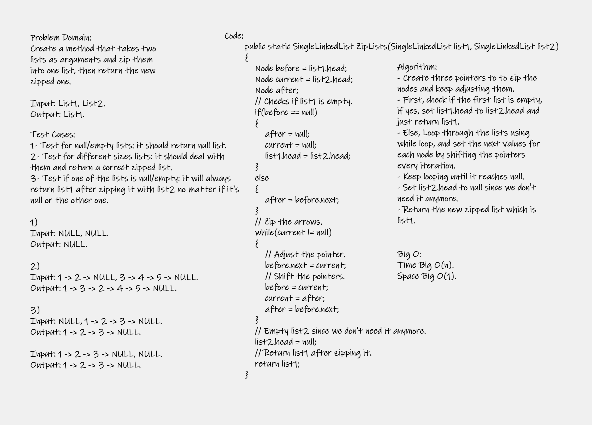

# Zip two linked lists Summary
---
Create a method that takes two lists as arguments and zip them into one list, then return the new zipped one.

---
## Whiteboard Process
<!-- Embedded whiteboard image -->


---
## Approach & Efficiency
I created pointers to zip the two lists and looped through them using while loop. So I kept changing the pointers every iteration and setting the next value for a specific pointer to make sure it changed then returned a modifed version on the first list and deleted the second by setting it's head to null. For this approach, the time is Big O(n); because of the while loop and for space it is Big O(1); because I modifed the firt list to be the zipped on, then returned it. So no additional space was required.

---
## Solution
You can run my code by opening the solution file and running the Program.cs file and see the output; because I provided a demo code in the main with comments. Below is the code of my method:

```
/// <summary>
        /// My ZipLists method returns the first list but it's modified to the zipped one,
        /// list2 is removed and set to null.
        /// </summary>
        /// <param name="list1"></param>
        /// <param name="list2"></param>
        /// <returns>list1 after zipping it with list2</returns>
        public static SingleLinkedList ZipLists(SingleLinkedList list1, SingleLinkedList list2)
        {
            Node before = list1.head;
            Node current = list2.head;
            Node after;
            // Checks if list1 is empty.
            if(before == null)
            {
                after = null;
                current = null;
                list1.head = list2.head;
            }
            else
            {
                after = before.next;
            }
            // Zip the arrows.
            while(current != null)
            {
                // Adjust the pointer.
                before.next = current;
                // Shift the pointers.
                before = current;
                current = after;
                after = before.next;
            }
            // Empty list2 since we don't need it anymore.
            list2.head = null;
            // Return list1 after zipping it.
            return list1;
        }

```