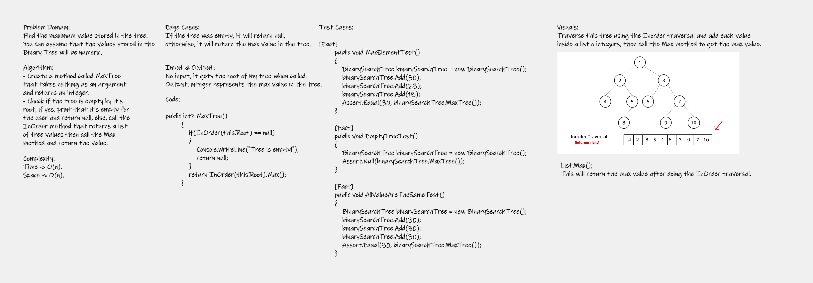

# Code Challenge: Class 16
Find the maximum value stored in the tree. You can assume that the values stored in the Binary Tree will be numeric.

## Whiteboard Process


## Approach & Efficiency
For time complexity, it is a O(n), and for space complexity, it is a O(n); because I used additional space which is the list that holds my values.

## Solution
You can run my solution by downloading the project, so open the solution file, then press CTRL + F5 or press on the run button to see the ouput on your console. 

Code:
```
public List<int> InOrder(Node root)
        {
            if (root == null)
            {
                Console.WriteLine("Tree is empty!");
                return null;
            }
            if (Root == root)
            {
                list.Clear();
            }
            if (root.Left != null)
            {
                InOrder(root.Left);
            }
            list.Add(root.Value);
            if (root.Right != null)
            {
                InOrder(root.Right);
            }
            return list;
        }
```

```
public int? MaxTree()
        {
            if(InOrder(this.Root) == null)
            {
                Console.WriteLine("Tree is empty!");
                return null;
            }
            return InOrder(this.Root).Max();
        }
```