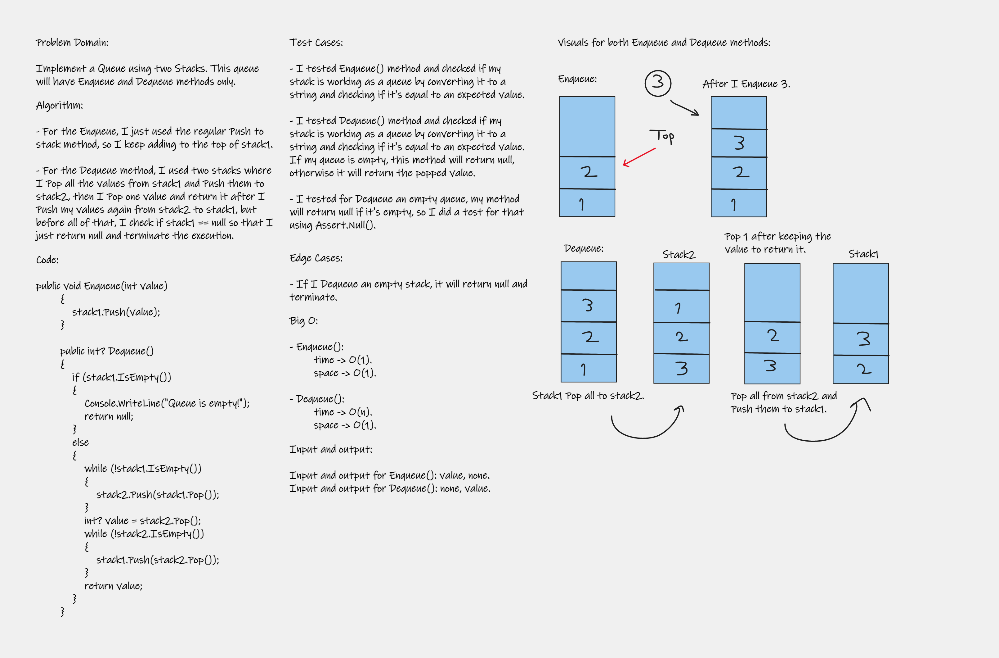

# Challenge Summary
Implement a Queue using two Stacks. This queue will have Enqueue and Dequeue methods only.

## Whiteboard Process



## Approach & Efficiency
+ For the Enqueue method, I used the regular push to stack method where I just keep pushing to the first stack, and for the space complexity, it is a O(1), and for the time complexity it is also a O(1).
+ For the Dequeue method, I used both of stacks to make it look like a queue, so I empty the first stack values and push them to the second stack, then pop one value and then push all the values from stack2 to stack1, and return the popped value. For the space complexity, it is a O(1), and for the time complexity it is also a O(n) since I have to use loops.

## Solution
You can run my code by downloading my project folder, then running Program.cs file to check the output.

Code:
```
    public class PseudoQueue
    {
        Stack stack1;
        Stack stack2;
        public PseudoQueue()
        {
            stack1 = new Stack();
            stack2 = new Stack();
        }

        public void Enqueue(int value)
        {
            stack1.Push(value);
        }

        public int? Dequeue()
        {
            if (stack1.IsEmpty())
            {
                Console.WriteLine("Queue is empty!");
                return null;
            }
            else
            {
                while (!stack1.IsEmpty())
                {
                    stack2.Push(stack1.Pop());
                }
                int? value = stack2.Pop();
                while (!stack2.IsEmpty())
                {
                    stack1.Push(stack2.Pop());
                }
                return value;
            }
        }

        public string PrintQueue()
        {
            string outPut = "";
            Node.Node temp = stack1.top;
            while (temp != null)
            {
                outPut += $"[{temp.data}] -> ";
                temp = temp.next;
            }
            outPut += "NULL";
            return outPut;
        }
    }
```
