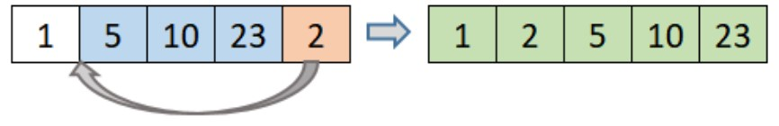

# Insertion sort
---
## Introduction
Selection Sort is a sorting algorithm that traverses the array multiple times as it slowly builds out the sorting sequence. The traversal keeps track of the minimum value and places it in the front of the array which should be incrementally sorted.

---
## How does it work?
It works by iterating through an array and sorting elements in a linear fashion.

### Steps:
1. The algorithm starts at elements 0 in an array and considers element sorted.
2. It then looks at the first element to the right of our sorted array that just contains our 0 position elements.
3. It then inserts this unsorted element in to it's correct location.
4. Our sorted array no has 2 elements.
5. The algorithm proceed to insert the next element into the correct position in our sorted array until the entire list has been sorted.

---
## Pseudo Code:

```
 InsertionSort(int[] arr)

    FOR i = 1 to arr.length

      int j <-- i - 1
      int temp <-- arr[i]

      WHILE j >= 0 AND temp < arr[j]
        arr[j + 1] <-- arr[j]
        j <-- j - 1

      arr[j + 1] <-- temp
```

---
## Code in C#:

```
public static void InsertionSortMethod(int[] arr)
        {
            int n = arr.Length;
            for (int i = 1; i < n; i++)
            {
                int j = i - 1;
                int temp = arr[i];

                while (j >= 0 && arr[j] > temp)
                {
                    arr[j + 1] = arr[j];
                    j--;
                }
                arr[j + 1] = temp;
            }
        }
```

---
## Space & Time Complexity:
+ Time: O(n^2):
The basic operation of this algorithm is comparison. This will happen n * (n-1) number of times…concluding the algorithm to be n squared.
+ Space: O(1): No additional space is being created. This array is being sorted in place…keeping the space at constant O(1).

---

## Example:
We have this unsorted array and we want to apply the insertion sort algorithm: 


After applying the insertion sort algorithms, these will be the steps of sorting it:

+ First Pass: On the first pass, we sart at element 0 and consider element sorted. 
	

+ Secod Pass: then we look at the first element to the right of our sorted array that just contains our 0 position element, we then insert this unsorted element into it's correct location. Our sorted array now has 2 elements.
	
	
+ Third Pass: then we look at the second element to the right of our sorted array that contains our 0 and 1 positions elements, we then insert this unsorted element into it's correct location. Oour sorted array now has 3 elements.
	
	
+ Fourth Pass: then we look at the third element to the right of our sorted array that contains our 0, 1, and 2 positions elements, we then insert this unsorted element into it's correct location. Oour sorted array now has 4 elements.
	
	
+ Fifth Pass: then we look at the fourth element to the right of our sorted array that contains our 0, 1, 2 and 3 positions elements, we then insert this unsorted element into it's correct location. Oour sorted array now has 5 elements.
	


