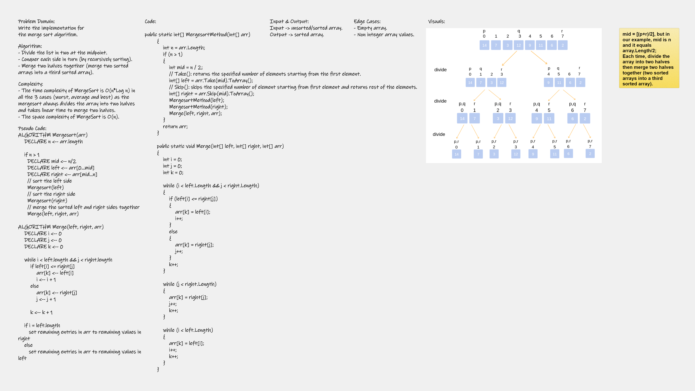

# Challenge 27

Implementation of Merge Sort.

+ Provide a visual step through for each of the sample arrays based on the provided pseudo code.
+ Convert the pseudo-code into working code in your language.
+ Present a complete set of working tests

---

# Whiteboard Process




---

# Approach & Efficiency
Merge sort is a sorting technique based on divide and conquer technique. With worst-case time complexity being Ο(n log n), and O(n) for space complexity.

---


# Solution
```
public static int[] MergesortMethod(int[] arr)
        {
            int n = arr.Length;
            if (n > 1)
            {
                int mid = n / 2;
                // Take(): returns the specified number of elements starting from the first element.
                int[] left = arr.Take(mid).ToArray();
                // Skip(): skips the specified number of element starting from first element and returns rest of the elements.
                int[] right = arr.Skip(mid).ToArray();
                MergesortMethod(left);
                MergesortMethod(right);
                Merge(left, right, arr);
            }
            return arr;
        }

        public static void Merge(int[] left, int[] right, int[] arr)
        {
            int i = 0;
            int j = 0;
            int k = 0;

            while (i < left.Length && j < right.Length)
            {
                if (left[i] <= right[j])
                {
                    arr[k] = left[i];
                    i++;
                }
                else
                {
                    arr[k] = right[j];
                    j++;
                }
                k++;
            }

            while (j < right.Length)
            {
                arr[k] = right[j];
                j++;
                k++;
            }

            while (i < left.Length)
            {
                arr[k] = left[i];
                i++;
                k++;
            }
        }
```