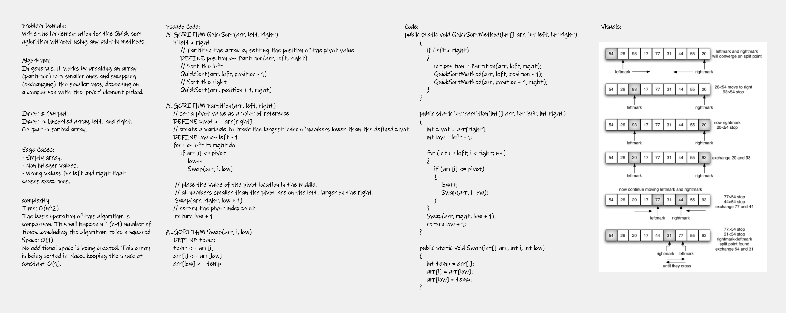

# Challenge 28 
## Implementation of Quick Sort. 

+ Provide a visual step through for each of the sample arrays based on the provided pseudo code.
+ Convert the pseudo-code into working code in your language.
+ Present a complete set of working tests.

---

## Whiteboard Process


---

## Approach & Efficiency
+ Time: O(n^2): the basic operation of this algorithm is comparison. This will happen n * (n-1) number of times…concluding the algorithm to be n squared.
+ Space: O(1): no additional space is being created. This array is being sorted in place…keeping the space at constant O(1).

---

## Solution

```
public static void QuickSortMethod(int[] arr, int left, int right)
        {
            if (left < right)
            {
                int position = Partition(arr, left, right);
                QuickSortMethod(arr, left, position - 1);
                QuickSortMethod(arr, position + 1, right);
            }
        }

        public static int Partition(int[] arr, int left, int right)
        {
            int pivot = arr[right];
            int low = left - 1;

            for (int i = left; i < right; i++)
            {
                if (arr[i] <= pivot)
                {
                    low++;
                    Swap(arr, i, low);
                }
            }
            Swap(arr, right, low + 1);
            return low + 1;
        }

        public static void Swap(int[] arr, int i, int low)
        {
            int temp = arr[i];
            arr[i] = arr[low];
            arr[low] = temp;
        }
```