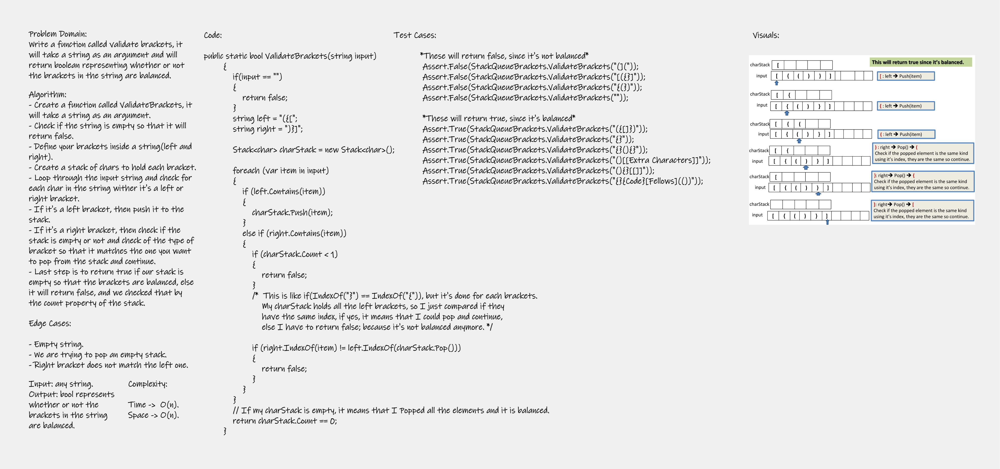

# Challenge13 Summary
Write a function called validate brackets, it will take a string as an argument and will return boolean representing whether or not the brackets in the string are balanced.

## Whiteboard Process


## Approach & Efficiency
I used a stack to hold my left brackets, so I loop through my input string then I check if it's a left or right bracket so that the left ones will be push and each time I have a right one, I will check if the previous bracket is the same type as my current one, if yes, I will pop from my stack and continue.

Note: I have an if-statement to check if my stack is empty; because I might have a greater number of left brackets than the right one, vice versa.

Complexity: Time O(n), Space O(n).

## Solution
Just download this project and modify the string inside my function call in the Program.cs file, then press Ctrl + F5 or press on the Run button to run the code.  

Code: 
```
public static bool ValidateBrackets(string input)
        {
            if(input == "")
            {
                return false;
            }
            string left = "({[";
            string right = ")}]";

            Stack<char> charStack = new Stack<char>();

            foreach (var item in input)
            {
                if (left.Contains(item))
                {
                    charStack.Push(item);
                }
                else if (right.Contains(item))
                {
                    if (charStack.Count < 1)
                    {
                        return false;
                    }
                    /*  This is like if(IndexOf("}") == IndexOf("{")), but it's done for each brackets.
                        My charStack holds all the left brackets, so I just compared if they
                        have the same index, if yes, it means that I could pop and continue, 
                        else I have to return false; because it's not balanced anymore. */

                    if (right.IndexOf(item) != left.IndexOf(charStack.Pop()))
                    {
                        return false;
                    }
                }   
            }
            // If my charStack is empty, it means that I Popped all the elements and it is balanced.
            return charStack.Count == 0;
        }
```