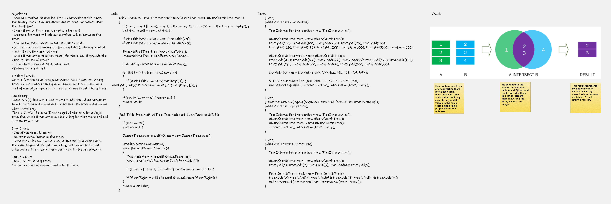

# Tree Intersection
Write a function called tree_intersection that takes two binary trees as parameters using your Hashmap implementation as a part of your algorithm, return a set of values found in both trees.

---

## Whiteboard Process



---
## Approach & Efficiency
+ Complexity: 
	+ Space -> O(n); because I had to create additional data structure to hold my returned values and for getting the trees nodes values when traversing.
	+ Time -> O(n^2); because I had to get all the keys for a single tree, then check if the other one has a key for that value and add it to my result list.

---
## Solution
<!-- Show how to run your code, and examples of it in action -->
Just press F5 or the run button to start the code. I wrote some comments that will help explaining how my code works.

**Code:**
```
        public List<int> Tree_Intersection(BinarySearchTree tree1, BinarySearchTree tree2)
        {
            // If one of the trees is empty, return null.
            if (tree1 == null || tree2 == null) { throw new Exception("One of the trees is empty!"); }

            // This list will contain our matched values.
            List<int> result = new List<int>();

            // Create two hash tables to use my hash table implementation.
            HashTable hashTable1 = new HashTable(20);
            HashTable hashTable2 = new HashTable(20);

            // Set the trees node values to the hash table I already created.
            BreadthFirstTree(tree1.Root, hashTable1);
            BreadthFirstTree(tree2.Root, hashTable2);

            // Get all keys for first tree.
            List<string> tree1Keys = hashTable1.Keys();

            // Check if the other tree has values for these key, if yes, add the value to the list of result.
            for (int i = 0; i < tree1Keys.Count; i++)
            {
                if (hashTable2.Contains(tree1Keys[i])) { result.Add(Int32.Parse(hashTable1.Get(tree1Keys[i]))); }
            }
            
            // If we don't have matches, return null.
            if (result.Count == 0) { return null; }

            // Return the result list.
            return result;
        }

        // Tree traversal.
        HashTable BreadthFirstTree(Tree.Node root, HashTable hashTable)
        {
            if (root == null)
            {
                return null;
            }

            Queue<Tree.Node> breadthQueue = new Queue<Tree.Node>();

            breadthQueue.Enqueue(root);
            while (breadthQueue.Count > 0)
            {
                Tree.Node front = breadthQueue.Dequeue();
                hashTable.Set($"{front.Value}", $"{front.Value}");

                if (front.Left != null)
                    breadthQueue.Enqueue(front.Left);

                if (front.Right != null)
                    breadthQueue.Enqueue(front.Right);
            }

            return hashTable;
        }
```