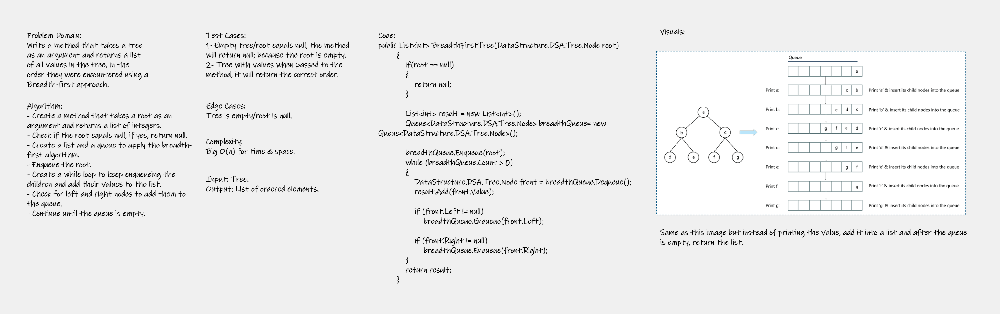

# Challenge 17
Write a method that takes a tree as an argument and returns a list of all values in the tree, in the order they were encountered using a Breadth-first approach.

---
## Whiteboard Process



---
## Approach & Efficiency
Big O(n) for space & time complexity.

---
## Solution
Code: 

```
public List<int> BreadthFirstTree(DataStructure.DSA.Tree.Node root)
        {
            if(root == null)
            {
                return null;
            }

            List<int> result = new List<int>();
            Queue<DataStructure.DSA.Tree.Node> breadthQueue= new Queue<DataStructure.DSA.Tree.Node>();

            breadthQueue.Enqueue(root);
            while (breadthQueue.Count > 0)
            {
                DataStructure.DSA.Tree.Node front = breadthQueue.Dequeue();
                result.Add(front.Value);

                if (front.Left != null)
                    breadthQueue.Enqueue(front.Left);

                if (front.Right != null)
                    breadthQueue.Enqueue(front.Right);
            }
            return result;
        }
```
